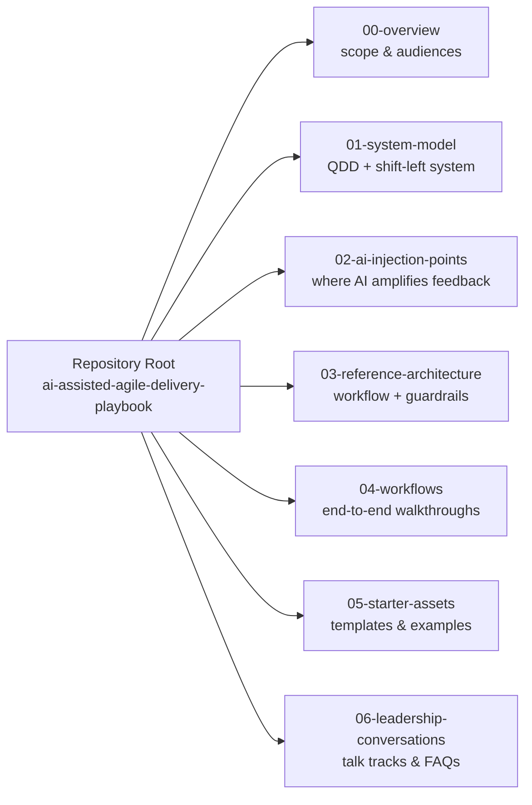
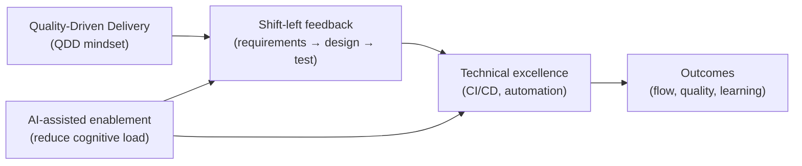

# Architecture at a Glance

This document provides a **visual orientation** to the *AI-Assisted Agile Delivery Playbook* repository.

It shows **how the major conceptual areas relate to each other** without going into tool-specific implementation details.
Use this as a map — not a specification.

---

## How to Use This Document

- Start with the **Repository Overview** diagram to understand scope
- Jump to the diagram that matches the question you’re asking
- Follow the links in each section to go deeper

You do not need to read this file top-to-bottom.

---

## Repository Overview

**Purpose:** Show the major areas of this repository and how they fit together (orientation only — not flow).

## System Storyline

**Purpose:** Establish the “primary storyline”: QDD + shift-left amplified by AI feedback loops.

### Diagram Index
- Repository Overview → see what’s in the repo
- System Storyline → QDD + shift-left + AI feedback loops
- AI Injection Points → where AI helps at requirements/design/test/code/ops
- Reference Architecture → how workflows, guardrails, and monitoring connect
- End-to-End Workflows → practical walkthroughs you can follow

